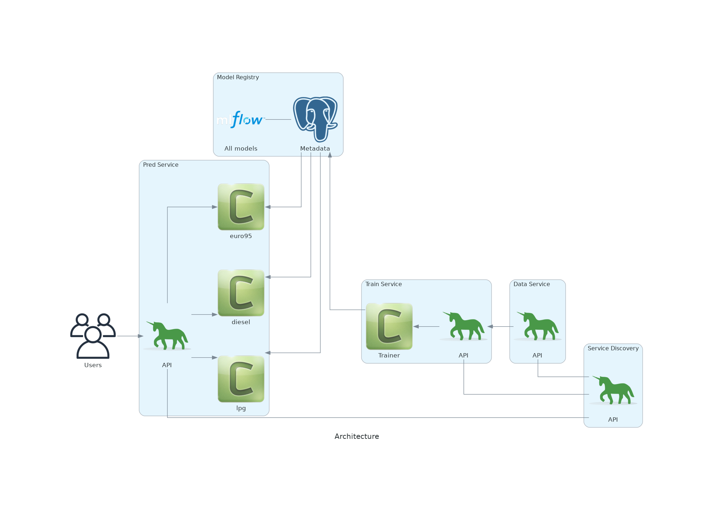

## Fuel Price Prediction Mlops

### Microservice approach to ML
#### Uses an external api to train 3 time series models to predict future fuel price

    cd services

    docker compose up -d

##### Pretty heavy (16+ gb)

